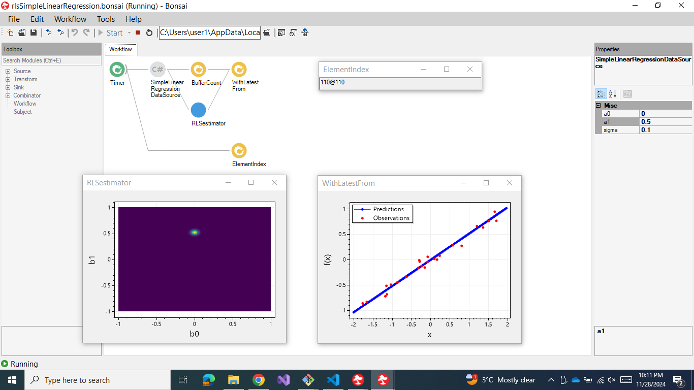

# Bonsai recursive least squares simple linear regression package

To run this demo:

1. clone this repository
2. execute `bonsai-rlsSimpleLinearRegressionDemo/.bonsai/Setup.cmd`
3. run `bonsai-rlsSimpleLinearRegressionDemo.bonsai/Bonsai.exe`
4. in Bonsai open the workflow `bonsai-rlsSimpleLinearRegressionDemo/package/rlsSimpleLinearRegression.bonsai`
5. press the `Start` button in Bonsai
